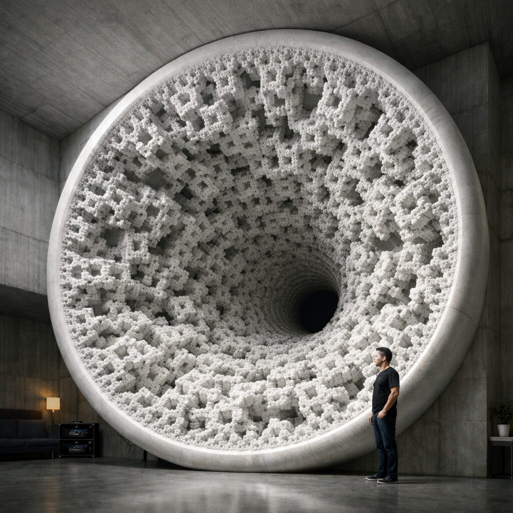

# SFH-OS: Syn-Fractal Horn Orchestration System

**Design, simulate and prepare for manufacture an acoustic horn whose throat is a fractal
surface.** A Claude Code-native pipeline: six skills as the agents, four MCP servers as the
tools, JSON schemas as the contracts between them.

| | |
|---|---|
| **Status** | Geometry, acoustic simulation and build preparation are implemented; no horn has been machined. |
| **Geometry** | Hilbert and Peano space-filling curves, Mandelbrot boundary expansion; Python, 525 lines |
| **Acoustics** | Transfer-matrix impedance, Webster horn equation, directivity, coverage angle, a scored frequency response; Python, 444 lines |
| **Fabrication** | Laser powder-bed fusion (L-PBF): orientation, supports, thermal distortion; build files in .3mf |
| **Not implemented** | Measurement (REW, OpenCV), machine control, closed-loop iteration |
| **Licence** | MIT |



*Concept render. The throat is the point: a fractal boundary gives a horn more surface area
and more path lengths than a smooth one of the same footprint.*

A standalone project on this account: the agent-and-tool pattern from the governance
architecture, applied to manufacturing.

## The hypothesis

A horn matches the high acoustic impedance at the driver throat to the low impedance of
open air. At any point the reflection coefficient is `Γ = (Z₂ − Z₁) / (Z₂ + Z₁)`. Classical
profiles (exponential, tractrix) minimise each Γ by expanding gradually. The fractal
approach distributes many small reflections across scales so that they interfere
destructively, in the way a fractal antenna achieves wideband matching.

| Method | What it contributes |
|---|---|
| Space-filling curves (Hilbert, Peano) | 6–10× the geometric path length inside the same envelope; curve order sets the scale of frequency interaction |
| Mandelbrot expansion | smooth large-scale flare from the main cardioid, fine boundary detail; the parameter `c` selects the horn's character |
| Fractal dimension D | the design window is 1.5–1.7: below 1.3 the benefit is lost, above 2.0 the part cannot be printed and viscous losses dominate |

Whether the simulated advantage survives a printed part is the open question, and the reason
the pipeline ends in measurement.

## The pipeline

| Phase | Skill | MCP server | Does |
|---|---|---|---|
| 1 Generative synthesis | `sfh-gen` | `geometry` | several candidate geometries, each with its fractal dimension and cross-sections |
| 2 Acoustic validation | `sfh-sim` | `acoustics` | impedance curve, polar response and an acoustic score per candidate, 500 Hz – 20 kHz; picks the winner |
| 3 Fabrication preparation | `sfh-mfg` | `fabrication` | printability, build orientation, supports, thermal simulation, L-PBF build file. Materials: AlSi10Mg, Ti6Al4V, 316L, Inconel 718 |
| 4 Verification | `sfh-qa` | (measurement, not built) | measured against simulated; pass, or return to phase 1 with learned constraints |
| — Visualisation | `sfh-viz` | `visualization` | renders, impedance and waterfall plots, polar balloons, support previews |
| — Orchestration | `sfh-conductor` | | pipeline state, conflicts between agents |

Requests, constraints and results pass between skills as JSON validated against
`schemas/request`, `constraint` and `result`.

## Getting started

Requires Claude Code with MCP support, Node.js 20+, Python 3.10+; FreeCAD 0.21+ is optional.

```bash
git clone https://github.com/toneron2/SFH-OS.git && cd SFH-OS
for s in geometry acoustics fabrication visualization; do (cd mcp-servers/$s && npm install && npm run build); done
```

Open Claude Code in the directory. Example: `Design a fractal horn for 1 kHz to 20 kHz
with 90° horizontal coverage`, or a single skill: `/sfh-gen Generate 3 Mandelbrot horn
variations with c=-0.75`.

## Contact

Tony Slosar · TODOMODO.IO AGENCY LLC · anthonyslosar@gmail.com · [t.me/toneron2](https://t.me/toneron2) · [slosars.me](https://slosars.me)
